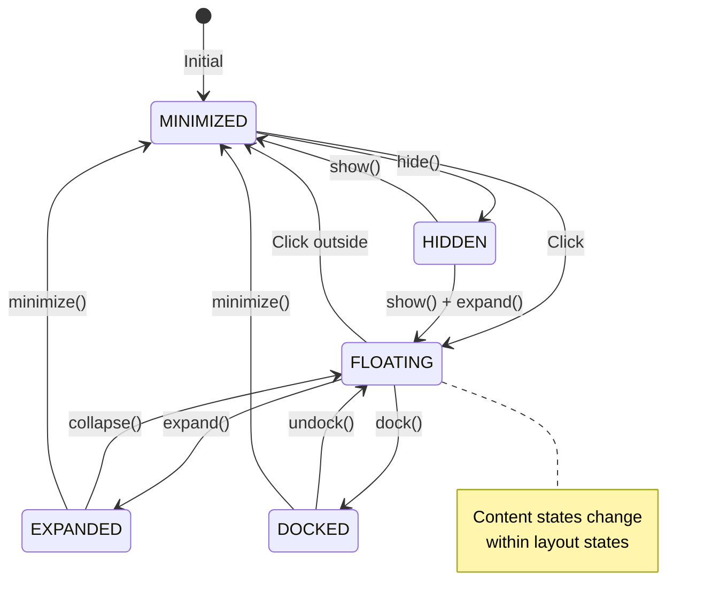

# Widget States - Visual Reference Guide

## Visual State Mockups

### Layout States

#### 1. MINIMIZED State
```
┌─────────────┐
│  ✨  NYT ?  │  ← Compact button (collapsed)
└─────────────┘
```

#### 2. FLOATING State
```
┌─────────────────────────────────┐
│ ✕                               │ ← Header with close
├─────────────────────────────────┤
│ 🔍 [ Ask Anything ] 🎤  NYT    │ ← Search bar
├─────────────────────────────────┤
│ ✨ Top Stories                  │
│ ✨ Breaking News                │ ← Suggestions
│ ✨ Generate a new Wordle        │
│                                 │
│        [ More ]                 │
├─────────────────────────────────┤
│    Powered by Claude   ✨       │ ← Footer
└─────────────────────────────────┘
```

#### 3. EXPANDED State
```
┌─────────────────────────────────────────────┐
│ ✕                                           │
├─────────────────────────────────────────────┤
│     🔍 [ Ask Anything ] 🎤      NYT        │
├─────────────────────────────────────────────┤
│                                             │
│                                             │
│                 (Content Area)              │ ← Larger content area
│                                             │
│                                             │
│                                             │
├─────────────────────────────────────────────┤
│         Powered by Claude   ✨              │
└─────────────────────────────────────────────┘
```

#### 4. DOCKED State (Bottom)
```
━━━━━━━━━━━━━━━━━━━━━━━━━━━━━━━━━━━━━━━━━━━━━━━
│ 🔍 [ Ask Anything ] 🎤  NYT  │ ✨ Suggestions│ ← Horizontal layout
━━━━━━━━━━━━━━━━━━━━━━━━━━━━━━━━━━━━━━━━━━━━━━━
```

### Content States

#### 1. IDLE State (Default)
```
│ ✨ Top Stories                  │
│ ✨ Breaking News                │
│ ✨ Generate a new Wordle        │
│                                 │
│        [ More ]                 │
```

#### 2. LOADING/SEARCHING State
```
│                                 │
│         ✨ (spinning)           │
│   Searching for answers...      │
│                                 │
```

#### 3. RESULTS State
```
│ Found 3 results                 │
├─────────────────────────────────┤
│ ✨ Results for "weather"        │
│    Latest weather updates...    │
├─────────────────────────────────┤
│ ✨ Breaking News Update         │
│    Current conditions...        │
├─────────────────────────────────┤
│ ✨ 7-Day Forecast              │
│    Extended outlook...          │
```

#### 4. ERROR State
```
│                                 │
│            ⚠️                   │
│   Oops! Something went wrong    │
│  Check your internet connection │
│                                 │
│        [ Try Again ]            │
```

#### 5. EMPTY State
```
│                                 │
│            🔍                   │
│  No results found for "xyz"     │
│  Try different keywords or      │
│    browse suggestions           │
│                                 │
│    [ View suggestions ]         │
```

#### 6. VOICE_INPUT State
```
│                                 │
│        ⭕ (pulsing)            │
│         🎤                      │
│       Listening...              │
│                                 │
│         [ Stop ]                │
```

## State Transition Flowchart



## Quick Reference Card

### State Constants
```typescript
// Layout States (Physical form)
WIDGET_STATES = {
  MINIMIZED: 'minimized',
  EXPANDED: 'expanded',
  FLOATING: 'floating',
  DOCKED: 'docked',
  HIDDEN: 'hidden',
}

// Content States (What's shown)
CONTENT_STATES = {
  IDLE: 'idle',
  LOADING: 'loading',
  SEARCHING: 'searching',
  RESULTS: 'results',
  ERROR: 'error',
  VOICE_INPUT: 'voice_input',
  EMPTY: 'empty',
}
```

### Common State Patterns

#### Pattern 1: Search Flow
```typescript
IDLE → user types → FOCUSED → enter → SEARCHING → RESULTS/EMPTY/ERROR
```

#### Pattern 2: Voice Flow
```typescript
IDLE → mic click → VOICE_INPUT → stop/timeout → SEARCHING → RESULTS
```

#### Pattern 3: Error Recovery
```typescript
ERROR → retry → SEARCHING → RESULTS/ERROR
```

#### Pattern 4: Navigation Flow
```typescript
RESULTS → back → IDLE
EMPTY → suggestions → IDLE
```

### State Combination Matrix

| Layout State | Valid Content States | Common Use Case |
|-------------|---------------------|-----------------|
| MINIMIZED | N/A | Widget collapsed |
| FLOATING | All content states | Normal usage |
| EXPANDED | All content states | Full-screen mode |
| DOCKED | IDLE, RESULTS | Quick access bar |
| HIDDEN | N/A | Widget not visible |

### Animation Timings

```typescript
const TRANSITIONS = {
  // Layout transitions
  minimize: 200,      // ms
  expand: 300,        // ms
  dock: 250,          // ms
  
  // Content transitions
  stateChange: 150,   // ms
  fadeIn: 200,        // ms
  fadeOut: 100,       // ms
  
  // Micro-interactions
  hover: 100,         // ms
  click: 50,          // ms
  loading: 1000,      // ms (loop)
};
```

## CSS Classes for States

### Layout State Classes
```css
.widget-minimized { /* Compact form */ }
.widget-floating { /* Default floating */ }
.widget-expanded { /* Full screen */ }
.widget-docked { /* Edge attached */ }
.widget-hidden { /* Display: none */ }
```

### Content State Classes
```css
.content-idle { /* Default view */ }
.content-loading { /* Loading spinner */ }
.content-results { /* Results list */ }
.content-error { /* Error message */ }
.content-empty { /* No results */ }
.content-voice { /* Voice input */ }
```

### State Transition Classes
```css
.state-entering { /* Fade in */ }
.state-exiting { /* Fade out */ }
.state-transition { /* Smooth transition */ }
```

## Component Mapping

### State → Component Map
```typescript
const STATE_COMPONENTS = {
  [CONTENT_STATES.IDLE]: IdleState,
  [CONTENT_STATES.LOADING]: LoadingState,
  [CONTENT_STATES.SEARCHING]: LoadingState,
  [CONTENT_STATES.RESULTS]: ResultsState,
  [CONTENT_STATES.ERROR]: ErrorState,
  [CONTENT_STATES.EMPTY]: EmptyState,
  [CONTENT_STATES.VOICE_INPUT]: VoiceInputState,
};

// Usage
const CurrentState = STATE_COMPONENTS[contentState];
return <CurrentState {...props} />;
```

## State Management Checklist

### Before Adding a New State

- [ ] Is it a layout state or content state?
- [ ] What triggers entry to this state?
- [ ] What are the exit conditions?
- [ ] What data does this state need?
- [ ] Which other states can it transition to?
- [ ] Does it need animation?
- [ ] What happens on error?
- [ ] How does it look on mobile?

### Implementation Checklist

- [ ] Add constant to `constants.ts`
- [ ] Create state component
- [ ] Add to state reducer/handler
- [ ] Update transition logic
- [ ] Add CSS classes
- [ ] Write tests
- [ ] Update documentation
- [ ] Add to visual guide

## Mobile Responsive States

### Minimized (Mobile)
```
┌─────────┐
│ ✨ NYT  │ ← Smaller, bottom-right
└─────────┘
```

### Floating (Mobile)
```
┌─────────────────┐
│ ✕               │
├─────────────────┤
│ 🔍 [    ] 🎤   │ ← Full width
├─────────────────┤
│ ✨ Suggestion 1 │
│ ✨ Suggestion 2 │ ← Fewer items
│    [ More ]     │
├─────────────────┤
│ Powered by ✨   │
└─────────────────┘
```

### Expanded (Mobile) = Full Screen
```
┌─────────────────┐
│                 │
│   Full Screen   │
│     Content     │
│                 │
└─────────────────┘
```

## Accessibility States

### Focus States
```
┌─────────────────────────────────┐
│ 🔍 [█Ask Anything ] 🎤  NYT    │ ← Input focused (cursor)
└─────────────────────────────────┘

┌─────────────────────────────────┐
│ ✨ Top Stories ←────────────────│ ← Item focused (outline)
└─────────────────────────────────┘
```

### Screen Reader Announcements
```typescript
// Announce state changes
<div role="status" aria-live="polite">
  {contentState === CONTENT_STATES.LOADING && "Searching..."}
  {contentState === CONTENT_STATES.RESULTS && `Found ${results.length} results`}
  {contentState === CONTENT_STATES.ERROR && "Error occurred, press Enter to retry"}
</div>
```

## Debug View

### State Inspector Component
```typescript
// Development only
{process.env.NODE_ENV === 'development' && (
  <div className="state-debug">
    Layout: {widget.state}
    Content: {contentState}
    Search: {searchValue}
    Results: {results.length}
    Error: {error?.message || 'none'}
  </div>
)}
```

### Console State Logger
```typescript
useEffect(() => {
  console.log('State Change:', {
    layout: widget.state,
    content: contentState,
    timestamp: Date.now(),
  });
}, [widget.state, contentState]);
```

## Common Issues & Solutions

| Issue | Cause | Solution |
|-------|-------|----------|
| State stuck in LOADING | API timeout | Add timeout handler |
| Can't exit ERROR | Missing reset | Add IDLE transition |
| Voice not stopping | No cleanup | Clear timeouts |
| Results disappear | State overwrite | Check transition logic |
| Animation glitch | Missing key | Add unique keys |

## Performance Tips

1. **Lazy Load States**
   - Only load ResultsState when needed
   - Code-split heavy components

2. **Memoize Renders**
   - Use React.memo for state components
   - Memoize expensive calculations

3. **Debounce Inputs**
   - Debounce search input
   - Throttle scroll events

4. **Optimize Animations**
   - Use CSS transforms
   - Avoid layout thrashing
   - Use will-change sparingly

## Testing Matrix

| State | Test Cases |
|-------|------------|
| MINIMIZED | Click expands, Persists position |
| FLOATING | Draggable, Click outside |
| LOADING | Shows spinner, Timeout handling |
| RESULTS | Displays items, Click handling |
| ERROR | Shows message, Retry works |
| VOICE | Animation plays, Stop works |

## Conclusion

This visual guide provides a quick reference for:
- How each state looks
- Valid state transitions
- Implementation patterns
- Common pitfalls

Use this alongside the architecture and implementation guides to build robust multi-state widgets.